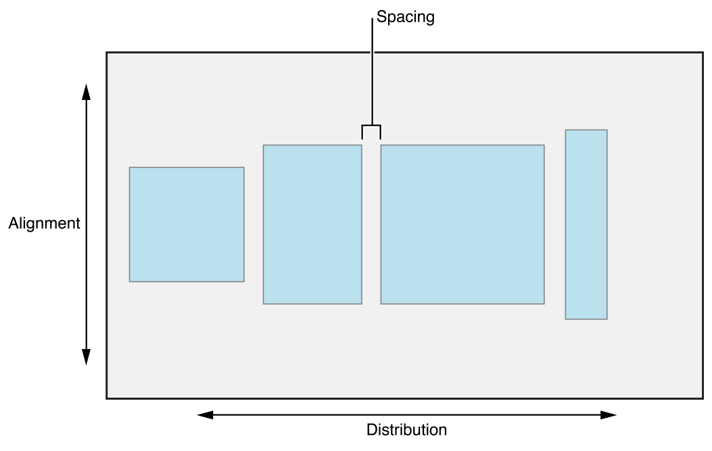
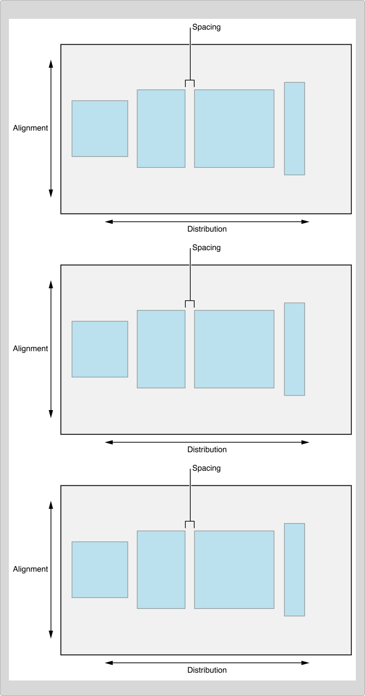
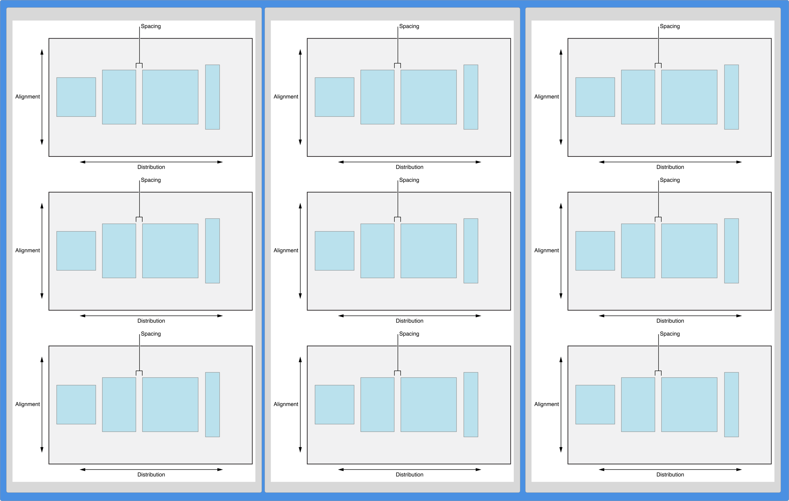
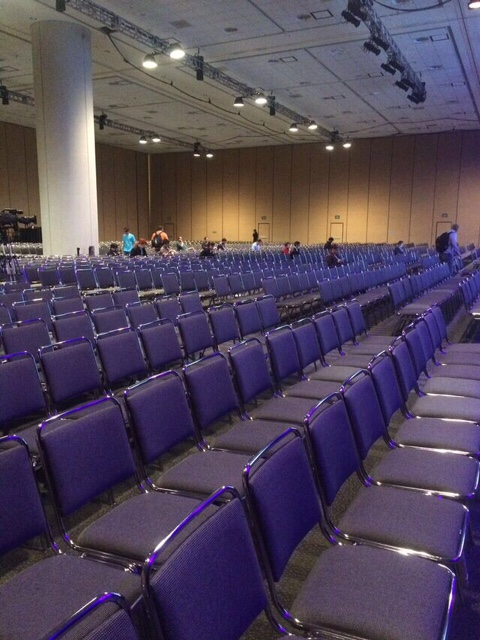

# UIStackView

## Yesterdays's Layout Tomorrow

^ this is your future

---

# Sean Levin

## Yahoo!

---

# UIStackView



^ nonrendering, UIView Subclass

^ storyboards, code, animation

^ built on autolayout constraints

^ "this is the layout method you should start with"

^ Size Classes & Storyboards

---

# UIStackView



---

# UIStackView



---


* Android's Linear Layout

* NSStackView
* ORStackView

---

# Interface Builder

## Example

^ what messed up, add some images

^ hot or not

---

# Code - UIStackView

```objectivec
- (void)viewDidLoad {
    [super viewDidLoad];

    self.stackView = [[UIStackView alloc] init];
    [self.view addSubview:self.stackView];

    self.label = [[UILabel alloc] init];
    self.label.text = @"First Name";

    self.imageView = [[UIImageView alloc] init];
    self.imageView.image = [UIImage imageNamed:@"super_sweet_avatar.jpg"];

    self.stackView.axis = UILayoutConstraintAxisHorizontal;
    [self.stackView addArrangedSubview:self.label];
    [self.stackView addArrangedSubview:self.imageView];
}
```

---

# Code - Autolayout

```objectivec
- (void)viewDidLoad {
    [super viewDidLoad];

    [self.view addConstraint:[NSLayoutConstraint
                              constraintWithItem:self.yellowView
                              attribute:NSLayoutAttributeHeight
                              relatedBy:NSLayoutRelationEqual
                              toItem:self.redView
                              attribute:NSLayoutAttributeHeight
                              multiplier:0.5
                              constant:0.0]];

    [self.view addConstraint:[NSLayoutConstraint
                              constraintWithItem:self.yellowView
                              attribute:NSLayoutAttributeHeight
                              relatedBy:NSLayoutRelationEqual
                              toItem:self.redView
                              attribute:NSLayoutAttributeHeight
                              multiplier:0.5
                              constant:0.0]];

    [self.view addConstraint:[NSLayoutConstraint
                              constraintWithItem:self.yellowView
                              attribute:NSLayoutAttributeHeight
                              relatedBy:NSLayoutRelationEqual
                              toItem:self.redView
                              attribute:NSLayoutAttributeHeight
                              multiplier:0.5
                              constant:0.0]];

    [self.view addConstraint:[NSLayoutConstraint
                              constraintWithItem:self.yellowView
                              attribute:NSLayoutAttributeHeight
                              relatedBy:NSLayoutRelationEqual
                              toItem:self.redView
                              attribute:NSLayoutAttributeHeight
                              multiplier:0.5
                              constant:0.0]];
}

```

---

# Animation


---

# Friction

## Duality of Syntax

^ change is absolute
^ technologies that minimizes cost and impact of change are good
^ autolayout was necessary for differing sizes
^ but friction was too high for changes

---

# Friction


---

#  WWDC

* Implementing UIDesigns in Interface Builder
* Mysteries of Autolayout, Part 1 & 2
* What's New in Storyboards

^ all examples in Swift

---

Best Practices in Progress Reporting




---
#  AltConf

* The Social Coding Contract, Justin Searls
* Being Nice in Open Source, Orta Therox
* Localization! Because 영어 n'est pas 足够 por todo el mundo, Laura Savino
* Planetary Engineering, Mike Lee

^ available online

---

# @seanlevin

^ feel free to ignore me on twitter
