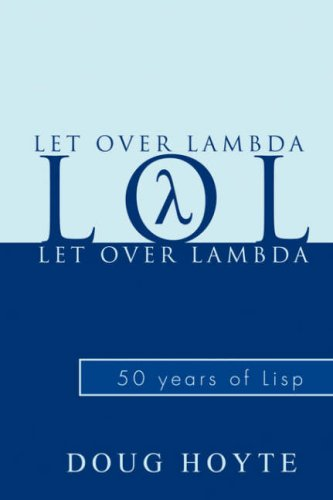
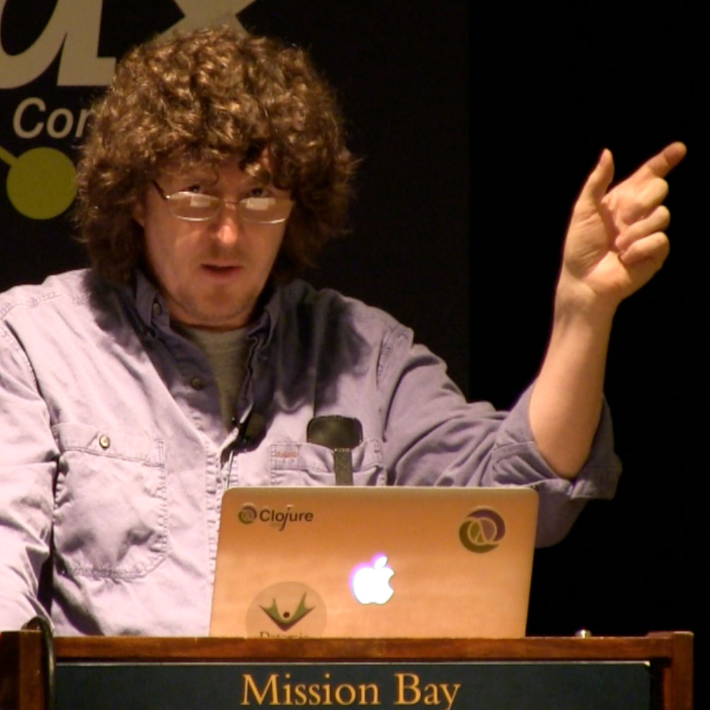

slidenumbers: true

# Object Oriented Programming

^original title

^people look at me funny, how is that interesting?

---

# Object Oriented Techniques and their Role in the Iterative Software Development Process

---

# Object Oriented Programming, Why _YOU_ suck at it and why _I_ rule.

## (Official title)

^controversy for the win

---

#Disclaimer


* No silver bullets
* In search of a better software process

^attempt to roll up a number of thoughts I've had the past year

^ comments are welcome

---

# What is OOP?

_over-asked uninteresting question_

^functions + data, classes, polymorphism, encapsulation, protection


---

# What is OOP?

_over-asked uninteresting question_

_with an interesting answer_

^functions + data, classes, polymorphism, encapsulation, protection

---

Common Lisp

```lisp
(defclass srt-time ()
  ((hr :initarg :hr :initform 0 :accessor hr)
   (mi :initarg :mi :initform 0 :accessor mi)
   (se :initarg :se :initform 0 :accessor se)
   (ms :initarg :ms :initform 0 :accessor ms))
  (:documentation "Time format for srt"))

(defgeneric display (what)
  (:documentation "Returns string that represents the object"))

(defgeneric normalise (time)
  (:documentation "Fix overflow of fields"))

(defmethod normalise ((time srt-time))
  (with-slots (hr mi se ms) time
    (loop until (< ms 1000) do (decf ms 1000) (incf se))
    (loop until (< se 60) do (decf se 60) (incf mi))
    (loop until (< mi 60) do (decf mi 60) (incf hr)))
  time)

(defmethod display ((time srt-time))
  (normalise time)
  (with-slots (hr mi se ms) time
    (format nil "~2,'0d:~2,'0d:~2,'0d,~3,'0d" hr mi se ms)))

(defun make-srt-time (arglist)
  (destructuring-bind (hr mi se ms) arglist
  (make-instance 'srt-time :hr hr :mi mi :se se :ms ms)))
```


^over 30 years old but is the model for clojure, go, rust

^polymorphism a la carte

---

Lua

```lua
Account = {balance = 0}

function Account:new (o)
    o = o or {}
    setmetatable(o, self)
    self.__index = self
    return o
end

function Account:deposit (v)
    self.balance = self.balance + v
end

function Account:withdraw (v)
    if v > self.balance then error"insufficient funds" end
    self.balance = self.balance - v
end

SpecialAccount = Account:new()

function SpecialAccount:withdraw (v)
    if v - self.balance >= self:getLimit() then
        error"insufficient funds"
    end

    self.balance = self.balance - v
end

function SpecialAccount:getLimit ()
    return self.limit or 0
end
```

^like Javascript construction is same language as rest of code


---

Java

```java
public interface MessageStrategy {
    public void sendMessage();
}

public abstract class AbstractStrategyFactory {
    public abstract MessageStrategy createStrategy(MessageBody mb);
}

public class MessageBody {
    Object payload;

    public Object getPayload() {
        return payload;
    }

    public void configure(Object obj) {
        payload = obj;
    }

    public void send(MessageStrategy ms) {
        ms.sendMessage();
    }
}

public class DefaultFactory extends AbstractStrategyFactory {
    private DefaultFactory() {;}
    static DefaultFactory instance;

    public static AbstractStrategyFactory getInstance() {
        if (instance==null) instance = new DefaultFactory();
        return instance;
    }

    public MessageStrategy createStrategy(final MessageBody mb) {
        return new MessageStrategy() {
            MessageBody body = mb;
            public void sendMessage() {
                Object obj = body.getPayload();
                System.out.println((String)obj);
            }
        };
    }
}

public class HelloWorld {
    public static void main(String[] args) {
        MessageBody mb = new MessageBody();
        mb.configure("Hello World!");
        AbstractStrategyFactory asf = DefaultFactory.getInstance();
        MessageStrategy strategy = asf.createStrategy(mb);
        mb.send(strategy);
    }
}
```

^patterns make for easy teasing but they are cooler than the jokes
would let on

---


Objective-c


---


#Object Oriented Langauges

All very different.

<br><br>
What do they all have in common?

^with so many wildly different languages all being object oriented; what do they all have in common?

^the interface

---

> _*The Interface*_

---

> _*The Interface*_
a mechanism for enabling dynamic behavior with static code

^it enables polymorphism

---
#Interface Example

```java
public class Person {
    public String name;

    public void printName() {
        System.out.println(name);
    }
}

public class VipPerson extends Person {
    public void printName() {
        System.out.println("Mr. " + name);
    }
}

public static void displayPerson(Person p) {
    p.printName();
}
```

^we will get back to this

---

# Why Object Oriented Programming?

_more interesting question_

^its not just for entertainment

---

If OOP is useful at all...


^ more awesome operator

^ first lets define more awesome

---

#What is a program?

A program is a machine executable definition of
a process that maps a set of inputs over time to a set of outputs over time meeting a set of given constraints.


^other constriants: performance, portability, binary size

---

#What is More Awesome?


* two programs
* meet same constraints
* is there an A more awesome than B?

^try to get audience to guess

---

#What is More Awesome?

What if we did one of these to B?

* Rot13 all variable and function names
* Minify

---

#Why is A more awesome than B?

^fish for answer (Change)
same performance
done the same way
both work who cares?
why would someone have to work on it?

---

> Change

^programs change

---


#Uncle Bob

Robert C. Martin

The secondary value of software is to meet the user's needs.
The primary value is to change.

^very sharp guy
silly videos
brushed off at first, but now convinced

---
#New Code

```java
public static void main(String[] args) {

}
```

^not buying it? here's an example

---

#Changing Old Code

```java
public static void main(String[] args) {
    System.out.println("Nice to meet you, Mr. Bowie");
}
```

---

#Changing Old Code

```java
public static void main(String[] args) {
    if (args.length > 0) {
        System.out.println("Nice to meet you, " + args[0]);
    } else {
        System.out.println("Nice to meet you, Mr. Bowie");
    }
}
```

---

#Changing Old Code

```java
public static void main(String[] args) {
    String greeting = "Nice to meet you, ";
    if (args.length > 0) {
        if (args[1].equals("Iman")) {
            System.out.println(greeting + "Mrs. Bowie");
        } else {
            System.out.println(greeting + args[0]);
        }
    } else {
        System.out.println(greeting + "Mr. Bowie");
    }
}
```

---

> Get it?

^ forget about future features you can't predict
approx 100% of time you are changing your own old code

---

> What's wrong with old code?

> Why is change a problem?

^there must be some answer otherwise people wouldn't
prefer starting fresh over fixing old stuff

---

# Answer: Internal Constraints

^ every line of code you add to meet an external constraint / feature
also contributes internal constraints to the pool

^and those existing internal constraints may conflict directly
with the code needed to implement the next external constraint

---

> Internal Constraints are a burden on Change

^ makes sense that if we can reduce the internal constraints
we can make code easier to change

---



#Duality of Syntax

## Let Over Lambda
## Doug Hoyte

Duality of Syntax

Same syntax multiple behaviors

Richard Gabriel: "Compression"

^really talking about lisp and macros, but the
concept still holds


---

# The Interface
The OOP mechanism for duality of syntax

```java
public class Person {
    public String name;

    public void printName() {
        System.out.println(name);
    }
}

public class VipPerson extends Person {
    public void printName() {
        System.out.println("Mr. " + name);
    }
}

public static void displayPerson(Person p) {
    p.printName();
}
```

^this has less internal constraints

^interface doesn't just mean java interface but the
concept behind it

---

# The Interface

```java
public class Person {
    private String name;

    public String getName() {
        return name;
    }

    public setName(String newName) {
        name = newName;
    }
}
```

^getters and setters

^for solving this vary problem (change)
and are exactly this, a new interface

^by using the getter/setter interface I can change code
in one place, instead of everywhere

---

#The Interface

* Enables the same functionality with _fewer internal constraints_
* Fewer internal constraints, means _easier to change_
* Easier to change means _more awesome!_ :dancers:

^the idea of managing change is a key takeaway

^as you code and implement features, think about
what you also could do to make things easier to change
in the future

---

> "I'm already using an object oriented language so I'm already doing this."

---

> Maybe...

^oop as a tool for problem conceptualization and modeling, sure

^as a tool for disentangling code, probably less so

---

# Building with Abstractions vs Abstracting

* UIViewController
* UIView
* UITableViewDelegate
* Hollywood Pattern and UIApplicationDelegate


^these are abstractions other people have come up with
so we can benefit from duality of syntax of their code

^fish for why its called hollywood pattern
"don't call us we'll call you"

---

# Origin of the 5000 line class

### Step 1: Take an existing abstraction
### Step 2: Give it a name that matches our problem domain
### Step 3: Add code to do stuff

^its not unreasonable to get in this situation
its perfectly natural

---

> Step 4: Refactor

^a step too often skipped over

---

# Writing is Rewriting

“By the time I am nearing the end of a story, the first part will have been reread and altered and corrected at least one hundred and fifty times. I am suspicious of both facility and speed. Good writing is essentially rewriting.” _-Roald Dahl_

“I have rewritten — often several times — every word I have ever published. My pencils outlast their erasers.” _-Vladimir Nabokov_

^preparing for this talk is an example

^helping Grace become a better writer is an example

---

# It's too hard to get code right the first time.

^trying to solve how to implement a feature
and whats the best place to put this code
I'm not smart enough

---


#Refactoring

##Martin Fowler

_"Elements of Style"_

_Code Smells_

* Duplicated Code
* Shotgun Surgery
* Long Method
* Speculative Generality
* _etc._

^tools for possible places and possible ways to make things better

^although smell kinda sounds like saying your code stinks
the metaphor they were after is that smells are possible
indicators that something needs your attention at some point

^feel free to check out my book at my desk

---

#Continuous Refactoring

* A perspective change: messes become problems with solutions
* Object oriented programming becomes a tool for taking things apart as well as putting things together
* Abstractions are fun!

^oop allows you to isolate independent parts of the code

^I guartantee after a few tries using that book, you'll do something
you love that you wouldn't have done before

---



#Rich Hickey

###Creator of Cojure

###Simple Made Easy

###Easy: nearby, subjective

###Simple: not intertwined, objective (not easy)

^best talk ever

^german is not easy if you don't know it

^simple often means many smaller separate pieces

^he's talking about abstractions

---

> Simplicity comes after complexity, not before.

^you've got to work for it

^nobody gets it right the first time

^oop is just one tool among many to help with the process

---


#Design Patterns

Abstractions for managing dependencies in ways not
directly supported by the language.

Build with: *bad*

Refactor to: *super sweet*

^see my books

---

> Indirecton without Abstraction

^design patterns without a problem

---

# "Where is anything getting done?!"

Abstractions mean more smaller pieces

Trading in physical locality for conceptual locality

Bad abstractions and bad names are still bad code

^just because we create an abstraction doesn't mean
we are making things better

^over estimate how easy giant methods and classes
are to deal with

---

## Abstractions aren't the problem

### Average adult has a 15,000 word vocabulary

### We don't understand every line of external libraries

### We certainly don't know what's behind Apple's abstractions

### Even worse...

---

# We don't even write our own programs

Contribution to your app breakdown:


^everything is an abstraction
the fact we don't think about it shows how
good we are at dealing with abstractions

^story of bacteria cells in our body outnumbers our own

---

> Its hard to refactor without any tests

^if moving things around might break something
you probably won't do it when you have to

---


#Test Driven Development
##Kent Beck

Tests are developed at the same time as the code.

Seems to elicit rather strong emotions.

---

> In Conclusion...

---

>Iterative Development

^inescapable process

^features will come and go

---

> Its too hard to get it right the first time

^or what was right could become less right

---

> Don't just stop at "It Works"

---


> Step 4: _Refactor_

> Make it work first,
then make it >>:dancers:

^remove duplication

^break things down into independent chunks

^don't just build with abstractions

---

> _fin_

> (_p.s. I still rule_)
