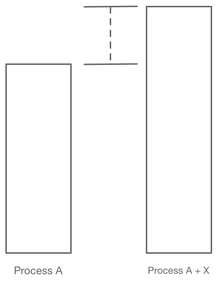
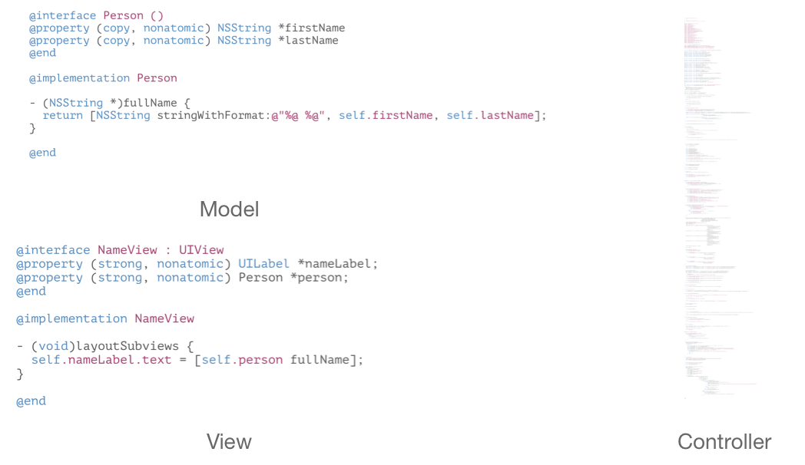
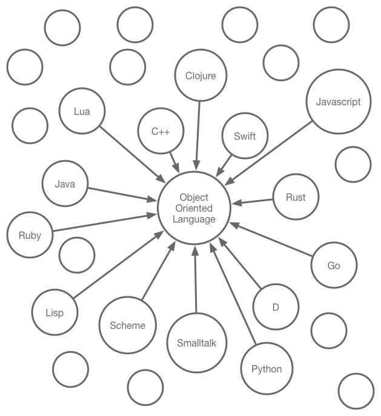
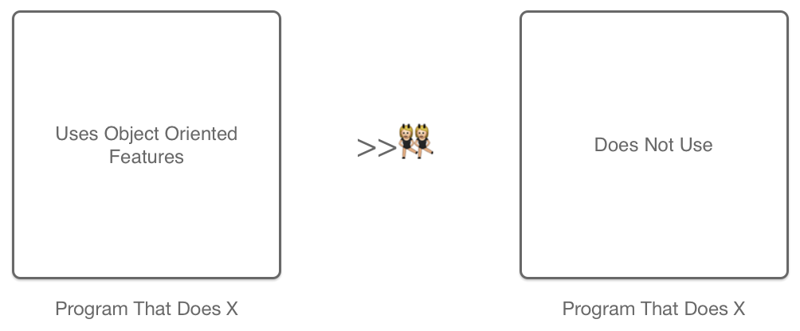

slidenumbers: true

# OOPWTF?

---

#Disclaimer



* No silver bullets
* In search of a better software process

^attempt to roll up a number of thoughts I've had the past year

^ comments are welcome

---

# What is OOP?

_hackneyed question, I know_

^functions + data, classes, polymorphism, encapsulation, protection

---

Lisp

```lisp
(defclass srt-time ()
  ((hr :initarg :hr :initform 0 :accessor hr)
   (mi :initarg :mi :initform 0 :accessor mi)
   (se :initarg :se :initform 0 :accessor se)
   (ms :initarg :ms :initform 0 :accessor ms))
  (:documentation "Time format for srt"))

(defgeneric display (what)
  (:documentation "Returns string that represents the object"))

(defgeneric normalise (time)
  (:documentation "Fix overflow of fields"))

(defmethod normalise ((time srt-time))
  (with-slots (hr mi se ms) time
    (loop until (< ms 1000) do (decf ms 1000) (incf se))
    (loop until (< se 60) do (decf se 60) (incf mi))
    (loop until (< mi 60) do (decf mi 60) (incf hr)))
  time)

(defmethod display ((time srt-time))
  (normalise time)
  (with-slots (hr mi se ms) time
    (format nil "~2,'0d:~2,'0d:~2,'0d,~3,'0d" hr mi se ms)))

(defun make-srt-time (arglist)
  (destructuring-bind (hr mi se ms) arglist
  (make-instance 'srt-time :hr hr :mi mi :se se :ms ms)))
```

^30 years old but is the model for clojure, go, rust
where implicit namespacing of methods doesn't restrict
adding new methods

---

Lua

```lua
Account = {balance = 0}

function Account:new (o)
    o = o or {}
    setmetatable(o, self)
    self.__index = self
    return o
end

function Account:deposit (v)
    self.balance = self.balance + v
end

function Account:withdraw (v)
    if v > self.balance then error"insufficient funds" end
    self.balance = self.balance - v
end

SpecialAccount = Account:new()

function SpecialAccount:withdraw (v)
    if v - self.balance >= self:getLimit() then
        error"insufficient funds"
    end

    self.balance = self.balance - v
end

function SpecialAccount:getLimit ()
    return self.limit or 0
end
```

^like Javascript construction is same language as rest of code


---

Java

```java
public interface MessageStrategy {
    public void sendMessage();
}

public abstract class AbstractStrategyFactory {
    public abstract MessageStrategy createStrategy(MessageBody mb);
}

public class MessageBody {
    Object payload;

    public Object getPayload() {
        return payload;
    }

    public void configure(Object obj) {
        payload = obj;
    }

    public void send(MessageStrategy ms) {
        ms.sendMessage();
    }
}

public class DefaultFactory extends AbstractStrategyFactory {
    private DefaultFactory() {;}
    static DefaultFactory instance;

    public static AbstractStrategyFactory getInstance() {
        if (instance==null) instance = new DefaultFactory();
        return instance;
    }

    public MessageStrategy createStrategy(final MessageBody mb) {
        return new MessageStrategy() {
            MessageBody body = mb;
            public void sendMessage() {
                Object obj = body.getPayload();
                System.out.println((String)obj);
            }
        };
    }
}

public class HelloWorld {
    public static void main(String[] args) {
        MessageBody mb = new MessageBody();
        mb.configure("Hello World!");
        AbstractStrategyFactory asf = DefaultFactory.getInstance();
        MessageStrategy strategy = asf.createStrategy(mb);
        mb.send(strategy);
    }
}
```

^patterns make for easy teasing but they are cooler than the jokes
would let on

---


Objective-c



---



What do they all have in common?

^with so many wildly different languages all being object oriented; what do they all have in common?

^the interface

---

> _*The Interface*_
a mechanism for enabling dynamic behavior with static code

^it enables polymorphism

---
#Interface Example

```java
public class Person {
    public String name;

    public void printName() {
        System.out.println(name);
    }
}

public class VipPerson extends Person {
    public void printName() {
        System.out.println("Mr. " + name);
    }
}

public static void displayPerson(Person p) {
    p.printName();
}
```

---

# Why Object Oriented Programming?

^what is academic, why has implications

---
If OOP is useful at all...



^ more awesome operator

^ first lets define more awesome

---

#What is a program?

A program is a machine executable implementation of
a set of constraints that maps a set of inputs over time to a set of outputs over time.


^other constriants: performance, portability, binary size

---

#What is more awesome?


* two programs
* meet same constraints
* is there an A more awesome than B?

^try to get audience to guess

---

#What is more awesome?

What if we did one of these to B?

* Rot13 all variable and function names
* Minify

---

#Why is A more awesome than B?

^fish for answer (Change)
same performance
done the same way
both work who cares?
why would someone have to work on it?

---

> Change

^programs change

---


#Uncle Bob

Robert C. Martin

The secondary value of software is to meet the user's needs.
The primary value is to change.

^very sharp guy
silly videos
brushed off at first, but now convinced

---
#New Code

```java
public static void main(String[] args) {

}
```

^not buying it? here's an example

---

#Changing Old Code

```java
public static void main(String[] args) {
    System.out.println("Nice to meet you, Mr. Bowie");
}
```

---

#Changing Old Code

```java
public static void main(String[] args) {
    if (args.length > 0) {
        System.out.println("Nice to meet you, " + args[0]);
    } else {
        System.out.println("Nice to meet you, Mr. Bowie");
    }
}
```

---

#Changing Old Code

```java
public static void main(String[] args) {
    String greeting = "Nice to meet you, ";
    if (args.length > 0) {
        if (args[1].equals("Iman")) {
            System.out.println(greeting + "Mrs. Bowie");
        } else {
            System.out.println(greeting + args[0]);
        }
    } else {
        System.out.println(greeting + "Mr. Bowie");
    }
}
```

---

> Get it?

^ forget about future features you can't predict
approx 100% of time you are changing your own old code

---

> What's wrong with old code?

> Why is change a problem?

^there must be some answer otherwise people wouldn't
prefer starting fresh over fixing old stuff

---

# Answer: Internal Constraints

^ every line of code you add to meet an external constraint / feature
also contributes internal constraints to the pool

and those existing internal constraints may conflict directly
with the code needed to implement the next external constraint

---

makes sense that if we can reduce the internal constraints


---


variable behavior is necessarily a reduction of internal constraints
which means it is easier to change from a mathematical point of view


---

so given two otherwise similar programs, the one that
is more adaptable to change is the one that is more awesome

---

of course change isn't an absolute; change to what?
a may be more amenable to change to y
while b may be more amenable to change to x

its an imperfect world, tough

---

amenable to change means total amount of effort
required to introduce a change:
clarity, internal constraints, reduction of bugs
introduced in the process

---

if there's anything to take away from this, its this
idea of the importance of change.

for every feature you implement, make a little mental todo
(or a real todo, I do)
that says, ok I got this working; can I move things around
so it will be easier to change this code in the future
(who may be you, with my wtf face on)

---


when I first heard the idea watching Uncle Bob videos
I brushed it off, "yeah interesting whatever"

but day in day out over the past year its hit me over and
over again, "oh yeah, totally!"

---

so in order for oop to be helpful, oop must provide
features that help manage change

---

duality of syntax

hoyte, picture of book

some quotation

lisp macros

(richard gabriel calls it compression)

---

the interface is the primary mechanism for enabling this
duality of syntax

I can have a block of code that works one way, and when it needs to
behave differently I can enable that behavior change without having to
change other parts. its variability of behavior its polymorphism

---

example of setters and getters as on obvious interface separation

---

probably need some examples of duality of syntax
in different languages (static and dynamic interfaces)

---

encapsulation is something that people bring up with oop, but again
this is just an interface; we set up rules where code can play nicely
with others and behind that wall we can change functionality

when we talk about abstractions, we are essentially putting a set of behaviors
behind an interface

---

design patterns and architecture are the same thing
if they make code better then they do it because they enable
change. in most cases, they provide flexibility in ways that
aren't directly supported by the language

---

my irrifutable logic by now has convinced you that lessening the costs
of change is an act of awesomeness, and that oop theoretically provides
this awesomeness by making change less of a burden, so how do you do
oop?

---

easy right? new file, type in class {} add some properties and functions
sweet, oop; what's the big deal? We all do it every day.

---

wrong

---

occasionaly my mind is brought back to the concept of
cargo cults and cargo cult programming

image, story behind the term

maybe more of a conclusion

---

mistaking the artifacts of a process for the process itself

(profound theory about life actually)

---

the artifacts are the classes objects interfaces

but the process is seeing where the same code can be leveraged to work
in different places and inserting interfaces that can isolate those changes
from other working parts of the code

---

key concept here is that is a process that goes on every step of the way as
we code. and being part of this process of finding seams where we can isolate
changes while leveraging other code we've written to accommodate internal constraints
is the magic that produces useful objects

---

The hard part is knowing where to put these seams. If we don't know where the next part
of code that will have to change will be, how can we justify abstractions.

That's a reasonable complaint. And its exactly how we end up with 300 line methods and 1000line
classes. We don't know so we get something working, perhaps we could have more flexibility
but it works, so why change it. I've got Artem banging on my desk asking me when I'm finished!

---

I don't think we can get it right the first time. Experience gives us some intuition but
its not enough. Refactoring is the only way.

---

Refactoring Book

definition: refactoring vs programming

how to find these seams, where to put code, and how to do it

code smells

---

I think we have an awkward relationship with the code we write.
We feel uncomfortable with some choices, worried we didn't do it as well as others

its important to get a better relationship and see it as part of a process; a process
of continual improvement and adjustment; the lessons in refactoring can help us take
a more mature position


---

in my experience, people only refactor when they have to in order to
enable a feature that they can't figure any way around

I just don't think people do it enough. I'm only just getting better
from rarely doing it myself. Its a shame because its fun when you know
what you are after.

its not just move code around willy nilly, its to find ways to enable
duality of syntax which becomes a seam we can use forever after

---

another problem with refactoring is that its hard without tests. rearranging
working code is just not worth it unless you have to or feel comfortable

refactoring tools are one way

but unit tests are the other.

---

Kent Beck, TDD Explained

big fan. my code has tests
because it has tests I move it around and have confidence that I can
move it to something that is more awesome, and by more awesome I mean
reduces the burden of future changes

---

so without refactoring, the kind of oop that leverages duality of syntax is too hard
and without tests refactoring is too hard

---

I know. You are all thinking you subclass views and view controllers, and
delegate objects. You are doing this way more than I am giving you credit for.

---

There's a difference between abstracting and building with abstractions.

somone else already has done the abstracting. because they want to use
duality of syntax so you can leverage their work

---

from the first moment you start a new project in xcode, they hand you a template with
an empty view controller. They wrote the app already, you are just filling in the blanks
in the empty method calls they already gave you.

The app is loaded into memory and starts running their code, then their code says, "anything else you want?"

this is the inversion of control pattern, or sometimes called the Hollywood pattern
"dont call us we'll call you"

the abstraction has already been built

so when it comes to finding where to put the code we just put it where we can find an empty
space. repeat until we have a 500 line funtion or 1000line class.

its not weird is normal, but I propose its suboptimal

---

The refactoring book has a number of places to start looking for places where oop can help
organize code and get dependencies under control

which they call code smells. Not because your code necessarily stinks but because things
are starting to get stale and it might be worth a little time cleaning out the fridge


---

the easiest place to start finding ways to improve organization is duplicated code

duplicated blocks of code indicates that there is an abstract concept that has
meaning in the logic. when you have duplicated code, pull it out into a function
give it a good name and start combining

this first step always starts uncovering things for me and I start pulling apart more
code and giving it better names and a few hours later I'm usually happy with the results

plus its fun

---

one problem I've definitely felt and I hear people have is as code starts getting broken
up you have to start looking around in lots of places to understand what anything does

I hear you, I've felt that. Its also the case that we might over estimate how easy to understand
100 line methods and 1000 line classes really are. Those are really daunting structures. And
I'd rather see those broken down to a few well named classes with well named functions.

Naming is hard, and I'm very guilty of giving things bad names. But its also part of the process
and we just keep working it to make things better.

---

I think the process of continual refactoring sheds a lot of light on Design Patterns.

As abstractions to build with, they feel snobby, complex, and overblown. But from the perspective
of refactoring as we begin to get our dependencies under control, they start showing up as
useful structures that enable our code to handle change without massive refactorings.

---

when viewed through the lens of refactoring for dependency management as part of the process
we see new problems to solve

these are fun problems

---

using oo to create abstractions with which we can isolate changes from other parts of the
code is a very useful tool to solve some of these problems

---

* when used like this oo is a scalpal not a building block

---

oo becomes more than just a tool for conceptualization of the problem space

eg, I'm going to write some network code so let me create a class called NetwrokManager

its fine for that but it doesn't offer any features particularly more powerful than just

opening a file and start typing in functions like you would do in C

---

the overall code starts to take on a component feel where parts of your program resemble libraries
like the ones given to us by apple that we can use to build the features of our app

---

simple made easy
complex vs simple
 rich hickey talk

---

some people complain that code broken down to abstractions is harder to follow

I understand and can share this opinion at times, but I don't think that is an
inherent problem with abstractions


* you don't know how apple's code works, not a single line of it
but you depend on it vitally

---

* just like that story how compared to the number of bacteria cells in your gut to number
of cells that are you is a tiny fraction; the number of lines

little graph (bill joy/linus torvalds joke)

---

* oop is not the only way to provide benefits

functional, static analyzers, better language idioms where the default choice
 of the language (the lazy choice) is the choice that makes future change easier

---

most importantly I think is recognizing that the most important thing we can do is
pay attention to our development process

we have strange relationship with the code we write and can get emotionally invested
in it when we are proud of it; or feel terrible when we mess up; or worry that other
people are writing better code that we aren't capable of

---

the truth is good code is the result of good process applied over and over; we will never
get things perfect, but if we distance ourselves from the code and invest emotionally in
our process then the code will be goo

* be emotionally invested in your process not the code that results from that process

---


style, mostly a matter of taste; taste is hard to target
we have to reach for things that we believe are more objective

eg, I could write all my function names in russian some people
would prefer that I'm sure


do I want to talk about different types of oop and how they support this?

clojure/swift/rust/go are similar

class based oop is just namespaces
  and a way to provide subtypes
  plus it comes at a cost of not being able to extend types

plus various degree of permission/hiding depending on language
- this isn't abstraction, its safety which has its ups and downs

* type based ploymorphism is an abstracted if statement
it can't change but in lua and javascript it can but
those you can reassign the path

* would love to talk about javascript and lua style of objects
in lua even namespaces are part of the language in tables
 its brilliant

* over engineered example of hello world
http://developers.slashdot.org/comments.pl?sid=33602&cid=3634763


story arc

what is oo?
its interfaces
why oo; if its worthwhile it must enable better
what's better?
reducing the burden of change is better
therefore oo is worthwhile if it reduces the burden of change
key concept code that does job with reduced burden of change >> code that does its job
there is something you can do with oo that you cannot with procedural progrmming
...and that's enabling different run time behavior
same code, different behavior == less dependencies and less code to change
too hard to write code this way, so we add refactoring as an extra step after implementing
if you want code that just does its job just write it
if you want code that is easy to change refactor (writing is editing)
and this gives us problems to solve
refactoring book, architectures, design patterns all point us to possible
directions to take the code that will help manage dependencies
and they all depend on oo
