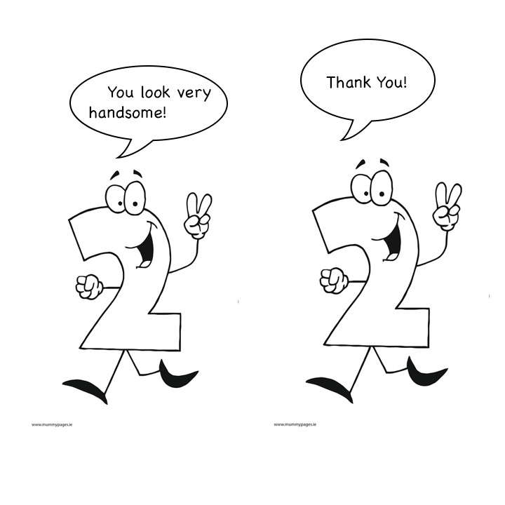

# Unsigned integer are Stoopid

---

### True Story about me


---

### Super sweet code

```objectivec
NSDate *startTime = [NSDate date];
NSTimeInterval seconds = 60 * 60 * 24 * [daysArray count] * -1;
startTime = [startTime dateByAddingTimeInterval:seconds];
```

<br/>

count returns NSUInteger

converts -1 into 2,147,483,647

startTime ~= 23,000 days in the future

---
# Interview Queston
```c
int si = -1;
unsigned int ui = 1;
if (si < ui) {
    printf("The secret admin password is k1ttenz");
} else {
    printf("Here your cash. Thank you for use ATM.");
}
```

<br/>
Totally secure, ship it!

---
## Twos Complement

```
0111 1111 /*  127 */
1000 0000 /* -128 */
```


If we used a sign bit, we get +0 and -0

That would be silly.

---

### Why?

* Maybe made sense when you could only have 256 element array.

* Makes a lot less sense when you can have 9,223,372,036,854,775,807

* I don't know what that number is.

---

> Unsigned integer is not an abstraction, its an implementation detail.
--Sean Levin

---
> It puts the most surprising, non-intuitive behavior right next to 0 where most applications are living. That's not cool.
-- Barack Obama

---

* Autoconvert: c, c++, objective-c, d, rust (with warning)
* Java has no unsigned integer (1 out of 9,456,245)
* c# and go will upconvert if there is room to grow
* Swift tells you to f off
* Ada has no unsigned, but does have, a mod type and a natural subtype
* Lua & Javascript only have floats
* Elixir rulez

---
## Swift

"Use UInt only when you specifically need an unsigned integer type with the same size as the platform’s native word size. If this is not the case, Int is preferred, even when the values to be stored are known to be non-negative."
<br/>

Also array.count returns Int in Swift

---
# TL;DR
Don't use.
