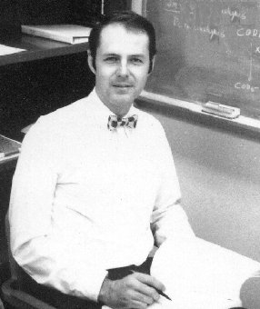
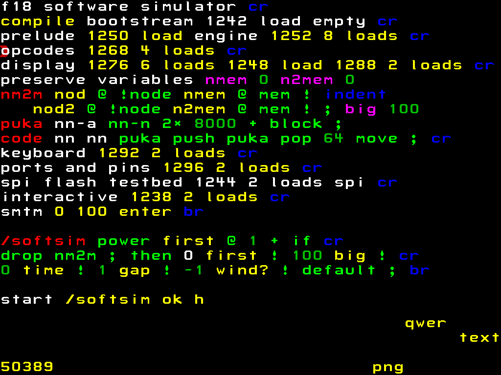

# Speculative Generality

---

# Speculative Generality

^ This is really going to be a clean framework. I'll make an abstract class out of this part so that folks can subclass it later, and I'll put in a bunch of well-commented overridable hooks in the concrete subclasses so that folks can use them as templates, and just in case somebody ever needs to build special debug subclasses, I'll put in extra stubs over there (somebody will thank me for 'em one of these days). Yeah, this is really going to be neat.

^ Thus is bloated software produced when our artistic sense gets the better of us. -- DaveSmith

---

# Examples

- Just in case baseclass
- Just in case parameters
- Single use interfaces/protocols
- Unused properties

^ people like abstractions, its fun

---

Charles Moore

^Do Not Speculate!

^Do not put code in your program that might be used. Do not leave hooks on which you can hang extensions. The things you might want to do are infinite; that means that each one has 0 probability of realization. If you need an extension later, you can code it later - and probably do a better job than if you did it now. And if someone else adds the extension, will they notice the hooks you left? Will you document that aspect of your program?

---

# YAGNI

> You ain't gonna need it
-- Kent Beck

 

- Only add code to implement the exact feature you are working on.
- Dont do tomorrow's work today.

---

# [fit] If I add this code today
# [fit] it will be easier than adding it
# [fit] later
# [fit] when I may need it.

---

# Martin Fowler
## Are people considering all the costs?

- Cost of Build
- Cost of Delay
- Cost of Carry
- Cost of Repair

^ unnecessary feature odds are at least 2/3

---

# [fit] Software
# [fit] Is Soft
# [fit] You can change it

---

# Changeable Code

- Write Tests
- Remove Duplication
- Don't generalize from a single example
- Flexibility is not speculative
- You still have to think

---

> Small decisions add up
